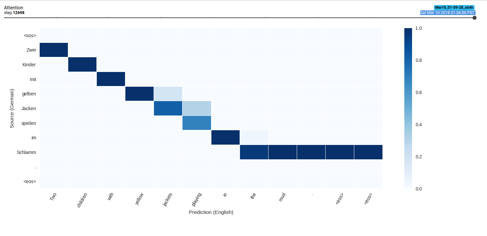

# Minimal Neural Machine Translation


## Resources
NEURAL MACHINE TRANSLATION BY JOINTLY LEARNING TO ALIGN AND TRANSLATE
https://arxiv.org/pdf/1409.0473.pdf

Effective Approaches to Attention-based Neural Machine Translation
https://arxiv.org/pdf/1508.04025.pdf

Massive Exploration of Neural Machine Translation Architectures
https://arxiv.org/pdf/1703.03906.pdf


## Contents
- Encoder --> Attention --> Decoder Architecture.
- Luong Attention.
- Training on Multi30k German to English translation task.
- Attention Visualization.
- Greedy Decoding.
- (tentative) beam search decoding.
- nmt tutorial notebook (in progress).

## Setup

1. install pytorch:
```
conda install pytorch -c pytorch
```

2. install other requirements:
```
pip install -r requirements.txt
```
## System Requirements
Training with a batch size of 32 takes ~3gb GPU ram.
If this is too much, lower the batch size or reduce network dimensionality in `hyperparams.py`.

## Usage
```
python train.py
```

view logs in Tensorboard
```
tensorboard --logdir runs
```
(partially trained attention heatmap)




